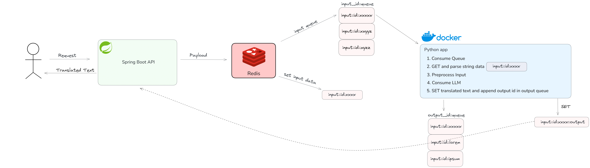

<h2 align="center"> Tradutor </h2>

Tradução de Textos consumindo LLM (08/2024) 

### Arquitetura do Serviço de Tradução:

    

## Requisição: /translate
    {
        "input_language": "Francês",
        "output_language": "Português",
        "text": "..."
    }

## Detalhes:
    1.0: Validação de dados de input são realizadas

    2.0: Assincronismo presente no processamento da tradução
        - @Async
        - Classe Genérica: CompletableFuture<T>

    3.0: Dados armazenados em memória (Redis) possuem TTL

## Linkedin e Gmail

 	

