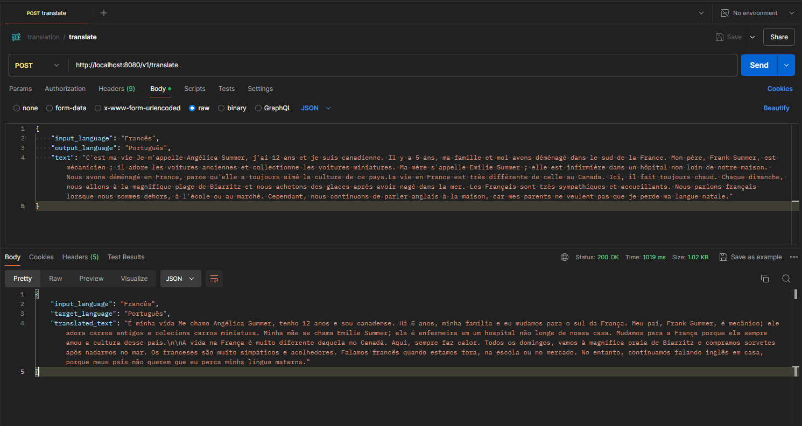

<h2 align="center"> Translator </h2>

Text Translation Using LLM (08/2024)

### Translation Service Architecture:

    

## Request: /translate

    

## Details:
    0.0: Configuration: 
        0.1: .env in the /ai/src directory
                0.1.2: API_KEY="groq API key" 

    1.0: Input data validation is performed

    2.0: Asynchronous translation processing
        - @Async
        - Generic Class: CompletableFuture<T>

    3.0: Data stored in memory (Redis) has TTL

## LinkedIn and Gmail

 	

